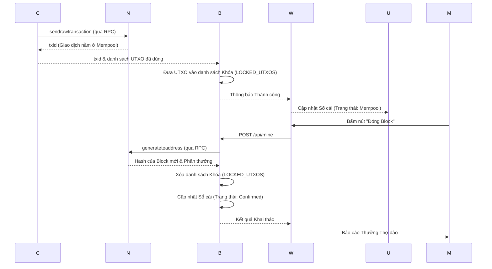

# Thiết kế Ứng dụng Ví Bitcoin (Regtest)

Tài liệu này tổng hợp toàn bộ các sơ đồ phân tích thiết kế hệ thống của Web App, bao gồm Use Case (Trường hợp sử dụng), Activity (Hoạt động) và Sequence (Trình tự).

## 1. Usecase Diagram
**Tác nhân (Actors):**
1. **Người dùng (User)**: Bất kỳ ai sở hữu Private Key (WIF).
2. **Thợ đào (Miner)**: Đóng vai trò xác nhận giao dịch trên mạng lưới.

**Các Usecase chính:**
- Đăng nhập bằng Private Key (WIF).
- Xem bảng điều khiển (Số dư tổng, số dư từng loại địa chỉ).
- Gửi tiền (Chỉ định số tiền và phí thợ đào).
- Xem lịch sử giao dịch (Sổ cái).
- Đóng Block (Dành cho Thợ đào).

## 2. Activity Diagram (Sơ đồ hoạt động)

```mermaid
flowchart TD
    A([Bắt đầu]) --> B[Đăng nhập bằng WIF]
    B --> C{Xác thực WIF?}
    C -- Lỗi --> B
    C -- Thành công --> D[Tải thông tin Ví]
- Nhập số tiền gửi, địa chỉ nhận và phí thợ đào.
- Nhấn "Khởi tạo Giao dịch".
- Chờ hiển thị Bảng Phân Tích (thấy được UTXO đã chọn, Thuật toán Ký, và Raw Hex).
- Xác nhận bằng cách nhấn "Phát Sóng Lên Mempool".
  
### Biểu đồ Activity (Activity Diagram)

```mermaid
graph TD
    A[Bắt đầu] --> B[Chọn Ví đăng nhập]
    B --> C[Giao diện chính (Glassmorphism) hiển thị]
    C --> D[Nhập Địa chỉ nhận, Số lượng, Phí thợ đào]
    D --> E[Bấm Khởi Tạo Giao Dịch]
    
    E --> F[API: /api/transaction/build]
    F --> G[Coin Selection & Tạo Chữ ký]
    G --> H[Sinh Raw Transaction Hex]
    H --> I[UI: Hiển thị Bảng Phân Tích (Wizard Bước 2)]
    
    I --> J{Người dùng duyệt?}
    J -- Hủy bỏ --> C
    J -- Đồng ý Phát sóng --> K[API: /api/transaction/broadcast]
    
    K --> L[Ném Hex vào Mempool]
    L --> M[Khóa UTXO chống Double Spend]
    M --> N[Lưu Lịch sử vào history.json]
    N --> O[Cập nhật UI thông báo thành công]
    O --> P[Kết thúc]
```

---

## 3. Biểu Đồ Tuần Tự (Sequence Diagram) - Core Flow

Chi tiết luồng Giao dịch (Tách biệt Build và Broadcast):


