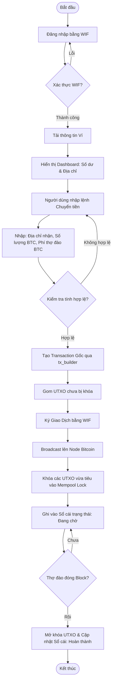
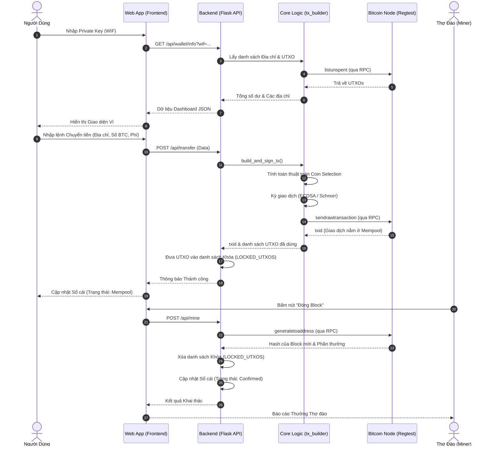

# Thiết kế Ứng dụng Ví Bitcoin (Regtest)

Tài liệu này tổng hợp toàn bộ các sơ đồ phân tích thiết kế hệ thống của Web App, bao gồm Use Case (Trường hợp sử dụng), Activity (Hoạt động) và Sequence (Trình tự).

## 1. Usecase Diagram
**Tác nhân (Actors):**
1. **Người dùng (User)**: Bất kỳ ai sở hữu Private Key (WIF).
2. **Thợ đào (Miner)**: Đóng vai trò xác nhận giao dịch trên mạng lưới.

**Các Usecase chính:**
- Đăng nhập bằng Private Key (WIF).
- Xem bảng điều khiển (Số dư tổng, số dư từng loại địa chỉ).
- Gửi tiền (Chỉ định số tiền và phí thợ đào).
- Xem lịch sử giao dịch (Sổ cái).
- Đóng Block (Dành cho Thợ đào).

## 2. Activity Diagram (Sơ đồ hoạt động)

## 3. Sequence Diagram (Sơ đồ tuần tự)

