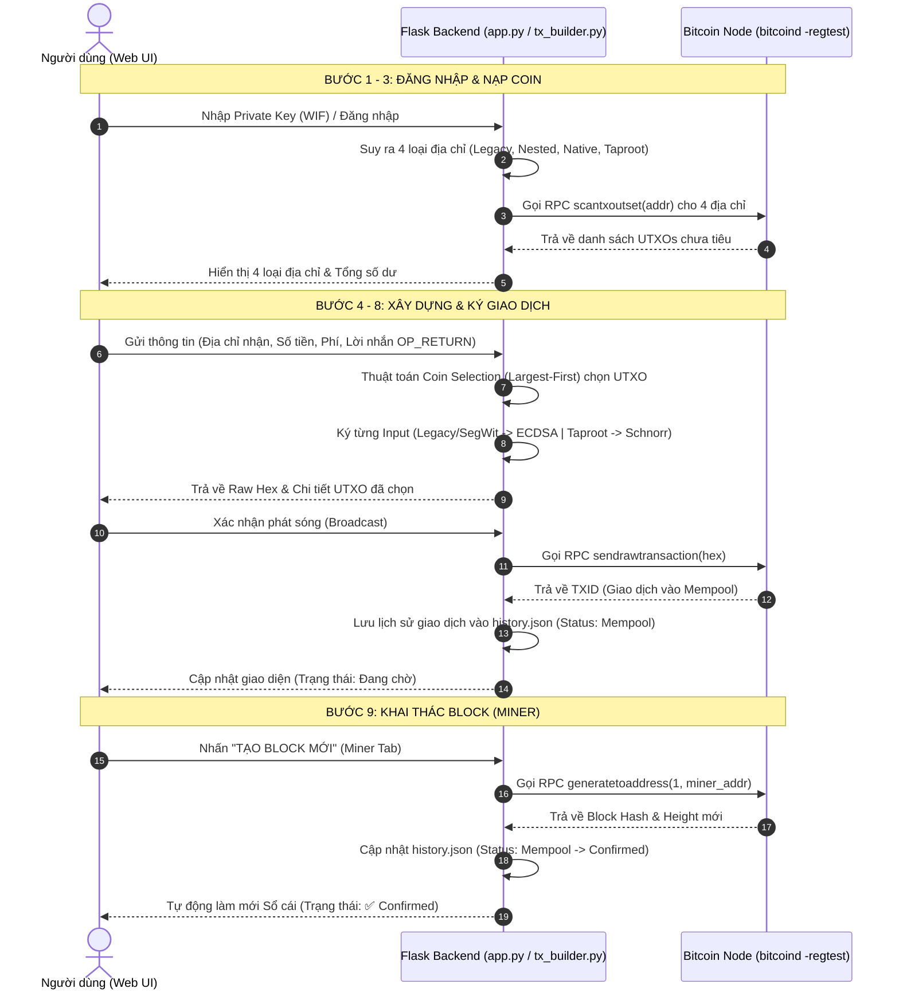

# BÁO CÁO GIẢI THÍCH MÃ NGUỒN VÀ KIẾN TRÚC DỰ ÁN BITCOIN REGTEST LAB

Báo cáo này tổng hợp toàn bộ kiến trúc hệ thống, giải thích mã nguồn chi tiết bám sát **9 Bước của Quy trình Đơn giản hóa (Simplified Flow)**, phân tích thuật toán ký số (ECDSA vs. Schnorr), luồng ứng dụng Web và hướng dẫn sử dụng các kịch bản kiểm thử nâng cao (Stress Test, Reorg Simulation).

---

## I. TỔNG QUAN KIẾN TRÚC HỆ THỐNG

### 1. Công nghệ & Mô hình Triển khai
* **Mạng lưới Bitcoin:** `bitcoind` chạy trên mạng **Regtest** (Regression Test Mode) đóng gói trong Docker Container `bitcoin/bitcoin:28.0`.
* **Backend:** Python 3.11 + Flask Web Server + Thư viện [`python-bitcoin-utils`](https://github.com/karask/python-bitcoin-utils).
* **Frontend:** HTML5, CSS3 (Vanilla + Bootstrap 5), JavaScript ES6 (Fetch API thuần, không Node.js/npm).
* **Đóng gói:** Docker Compose gồm 2 services độc lập (`bitcoind` và `app`).

### 2. Sơ đồ Luồng Dữ liệu (Sequence Diagram)
Dưới đây là sơ đồ tương tác giữa người dùng (Web Browser), backend Flask và Bitcoin Node RPC:



---

## II. GIẢI THÍCH CHI TIẾT THEO 9 BƯỚC SIMPLIFIED FLOW

### Bước 1: Setup Node Regtest & RPC Proxy
- **File thực thi:** [`src/tx_builder.py`](file:///c:/Users/Tuana/Downloads/bitcoin-thuc-hanh-1/src/tx_builder.py#L9-L17)
- **Giải thích:** Đọc biến môi trường (`RPC_HOST`, `RPC_PORT`, `RPC_USER`, `RPC_PASSWORD`) để khởi tạo đối tượng `NodeProxy`. Thiết lập mạng mặc định là `regtest`.

```python
RPC_HOST = os.environ.get("RPC_HOST", "127.0.0.1")
RPC_PORT = os.environ.get("RPC_PORT", "18443")
RPC_USER = os.environ.get("RPC_USER", "dev")
RPC_PASSWORD = os.environ.get("RPC_PASSWORD", "devpass")

setup('regtest')
proxy = NodeProxy(RPC_USER, RPC_PASSWORD, RPC_HOST, RPC_PORT)
```

---

### Bước 2: Suy ra 4 loại địa chỉ Bitcoin từ 1 Private Key
- **File thực thi:** [`src/tx_builder.py`](file:///c:/Users/Tuana/Downloads/bitcoin-thuc-hanh-1/src/tx_builder.py#L20-L31) / [`src/wallet_faucet.py`](file:///c:/Users/Tuana/Downloads/bitcoin-thuc-hanh-1/src/wallet_faucet.py#L20-L55)
- **Giải thích:** Từ 1 chuỗi WIF (Private Key), tạo Public Key và suy ra 4 chuẩn địa chỉ Bitcoin phổ biến:
  1. **Legacy (P2PKH):** Bắt đầu bằng `m` hoặc `n` trên Regtest.
  2. **Nested SegWit (P2SH-P2WPKH):** Bọc Script P2WPKH vào P2SH, bắt đầu bằng `2`.
  3. **Native SegWit (P2WPKH):** Bech32 encoding, bắt đầu bằng `bcrt1q`.
  4. **Taproot (P2TR):** Bech32m encoding (BIP341), bắt đầu bằng `bcrt1p`.

```python
def derive_all_address_types(wif: str) -> dict:
    priv = PrivateKey(wif)
    pub = priv.get_public_key()
    p2wpkh = pub.get_segwit_address()
    
    return {
        "legacy": pub.get_address().to_string(),
        "nested_segwit": P2shAddress.from_script(p2wpkh.to_script_pub_key()).to_string(),
        "native_segwit": p2wpkh.to_string(),
        "taproot": pub.get_taproot_address().to_string()
    }
```

---

### Bước 3: Nạp coin cho các loại địa chỉ (Miner Faucet)
- **File thực thi:** [`src/wallet_faucet.py`](file:///c:/Users/Tuana/Downloads/bitcoin-thuc-hanh-1/src/wallet_faucet.py#L60-L82)
- **Giải thích:** Trong mạng Regtest không có Faucet thật trên Internet. Tiền được tạo ra thông qua việc đào block (`generatetoaddress`). Thưởng khối (Coinbase Reward = 50 BTC) được trả thẳng về địa chỉ cần nạp. Đào thêm 100 block để coin vượt qua khoảng thời gian "trưởng thành" (Coinbase Maturity = 100 blocks).

```python
def fund_address(address: str, num_blocks: int = 1):
    return proxy.generatetoaddress(num_blocks, address)
```

---

### Bước 4: Liệt kê UTXO của từng địa chỉ (`scantxoutset`)
- **File thực thi:** [`src/tx_builder.py`](file:///c:/Users/Tuana/Downloads/bitcoin-thuc-hanh-1/src/tx_builder.py#L34-L43)
- **Giải thích:** Sử dụng lệnh RPC `scantxoutset` với descriptor `addr(<address>)` để quét toàn bộ tập hợp UTXO chưa tiêu trên Blockchain.

```python
def get_utxos_by_address(address: str) -> dict:
    scan_request = [{"desc": f"addr({address})"}]
    return proxy.scantxoutset("start", scan_request)
```

---

### Bước 5: Coin Selection & Dynamic Fee Estimation
- **File thực thi:** [`src/tx_builder.py`](file:///c:/Users/Tuana/Downloads/bitcoin-thuc-hanh-1/src/tx_builder.py#L47-L90)
- **Giải thích:**
  - **Thuật toán Coin Selection (Largest-First):** Sắp xếp UTXO theo giá trị giảm dần và ưu tiên chọn tờ tiền lớn nhất. Mục đích là giảm thiểu số lượng Input, qua đó giảm dung lượng giao dịch (vbytes) và tiết kiệm phí miner.
  - **Ước lượng phí động (Dynamic Fee):** Kích thước từng loại Input khác nhau: Legacy (~148 bytes), SegWit (~68 vbytes), Taproot (~57.5 vbytes). Phí được tính theo công thức:
    $$\text{Phí (BTC)} = \frac{(\text{Base Size} + \text{Input Size} \times N_{\text{inputs}} + \text{Output Size} \times N_{\text{outputs}}) \times \text{Fee Rate}}{100,000,000}$$

```python
def select_utxos(utxos: list, target_amount: Decimal) -> tuple[list, Decimal]:
    sorted_utxos = sorted(utxos, key=lambda x: x["amount"], reverse=True)
    selected = []
    total_gathered = Decimal('0.0')
    for utxo in sorted_utxos:
        selected.append(utxo)
        total_gathered += Decimal(str(utxo["amount"]))
        if total_gathered >= target_amount:
            return selected, total_gathered
    raise ValueError(f"Không đủ tiền! Cần {target_amount} BTC.")
```

---

### Bước 6 & 7: Xây dựng Cấu trúc & Ký Giao dịch (ECDSA vs. Schnorr)

- **File thực thi:** [`src/tx_builder.py`](file:///c:/Users/Tuana/Downloads/bitcoin-thuc-hanh-1/src/tx_builder.py#L93-L152)

#### Phân tích chuyên sâu thuật toán Ký số (ECDSA vs. Schnorr)

Trong Bitcoin, các chuẩn địa chỉ khác nhau sử dụng thuật toán và định dạng ký khác nhau. Code hỗ trợ **Mix UTXO** (gộp nhiều loại địa chỉ khác nhau vào cùng 1 giao dịch):

| Loại địa chỉ | Thuật toán ký | Hàm ký sử dụng | Cấu trúc Witness / ScriptSig |
|---|---|---|---|
| **Legacy (P2PKH)** | ECDSA | `priv_key.sign_input()` | `script_sig` = `<sig> <pubkey>`, `witness` = rỗng |
| **Nested SegWit (P2SH-P2WPKH)** | ECDSA (BIP143) | `priv_key.sign_segwit_input()` | `script_sig` = `<push redeem_script>`, `witness` = `[sig, pubkey]` |
| **Native SegWit (P2WPKH)** | ECDSA (BIP143) | `priv_key.sign_segwit_input()` | `script_sig` = rỗng, `witness` = `[sig, pubkey]` |
| **Taproot (P2TR)** | Schnorr (BIP340/341) | `priv_key.sign_taproot_input()` | `script_sig` = rỗng, `witness` = `[schnorr_sig]` |

> **[!IMPORTANT] Điểm khác biệt cốt lõi khi ký Taproot (Schnorr):**
> Khi ký input Taproot, hàm `sign_taproot_input` bắt buộc phải truyền **mảng `all_scripts` và mảng `all_amounts` của TẤT CẢ các input** có trong giao dịch (BIP341 Sighash Digest commitment). Điều này ngăn chặn việc kẻ tấn công gian lận số tiền của các input khác.

```python
def sign_transaction_inputs(tx: Transaction, priv_key: PrivateKey, selected_utxos: list) -> Transaction:
    pub = priv_key.get_public_key()
    
    # 1. Chuẩn bị mảng Scripts và Amounts bắt buộc cho Schnorr Signature (Taproot - BIP341)
    all_scripts = []
    all_amounts = []
    for utxo in selected_utxos:
        a_type = utxo["addr_type"]
        if a_type == "legacy": spk = pub.get_address().to_script_pub_key()
        elif a_type in ["nested_segwit", "native_segwit"]: spk = pub.get_segwit_address().to_script_pub_key()
        elif a_type == "taproot": spk = pub.get_taproot_address().to_script_pub_key()
        all_scripts.append(spk)
        all_amounts.append(to_satoshis(utxo["amount"]))

    # 2. Vòng lặp ký từng Input theo đúng chuẩn
    for index, utxo in enumerate(selected_utxos):
        a_type = utxo["addr_type"]
        if a_type == "legacy":
            sig = priv_key.sign_input(tx, index, pub.get_address().to_script_pub_key())
            tx.inputs[index].script_sig = Script([sig, pub.to_hex()])
            tx.witnesses.append(TxWitnessInput([]))
        elif a_type == "nested_segwit":
            p2pkh_script = pub.get_address().to_script_pub_key()
            redeem_script = pub.get_segwit_address().to_script_pub_key()
            sig = priv_key.sign_segwit_input(tx, index, p2pkh_script, to_satoshis(utxo["amount"]))
            tx.inputs[index].script_sig = Script([redeem_script.to_hex()])
            tx.witnesses.append(TxWitnessInput([sig, pub.to_hex()]))
        elif a_type == "native_segwit":
            p2pkh_script = pub.get_address().to_script_pub_key()
            sig = priv_key.sign_segwit_input(tx, index, p2pkh_script, to_satoshis(utxo["amount"]))
            tx.witnesses.append(TxWitnessInput([sig, pub.to_hex()]))
        elif a_type == "taproot":
            # Schnorr Signature cần commit toàn bộ inputs
            sig = priv_key.sign_taproot_input(tx, index, all_scripts, all_amounts)
            tx.witnesses.append(TxWitnessInput([sig]))
    return tx
```

---

### Bước 8: Broadcast Raw Transaction
- **File thực thi:** [`src/app.py`](file:///c:/Users/Tuana/Downloads/bitcoin-thuc-hanh-1/src/app.py#L172-L211)
- **Giải thích:** Mã Hex hoàn chỉnh sau khi ký được gửi lên Bitcoin Node bằng lệnh RPC `sendrawtransaction`. Sau khi thành công, các UTXO vừa tiêu sẽ được ghi vào tập hợp `LOCKED_UTXOS` để tránh double-spend, đồng thời lưu lịch sử vào `data/history.json` với trạng thái `"Mempool"`.

```python
@app.route('/api/transaction/broadcast', methods=['POST'])
def broadcast_transaction():
    ...
    txid = proxy.sendrawtransaction(hex_tx)
    # Khóa UTXO để tránh dùng lại trong khi chờ block
    for u in selected_utxos:
        LOCKED_UTXOS.add(f"{u['txid']}:{u['vout']}")
    ...
```

---

### Bước 9: Khai thác Block (Miner Dashboard) & Xác nhận Giao dịch
- **File thực thi:** [`src/app.py`](file:///c:/Users/Tuana/Downloads/bitcoin-thuc-hanh-1/src/app.py#L213-L246) / [`src/static/js/main.js`](file:///c:/Users/Tuana/Downloads/bitcoin-thuc-hanh-1/src/static/js/main.js#L625-L657)
- **Giải thích:** Thợ đào gọi `proxy.generatetoaddress(1, miner_addr)` để đóng 1 block mới. Khi block được đóng:
  1. Toàn bộ giao dịch trong Mempool được đóng gói vào Block.
  2. `LOCKED_UTXOS.clear()` giải phóng các khóa tạm thời.
  3. Cập nhật tất cả trạng thái giao dịch trong `data/history.json` từ `Mempool` $\rightarrow$ `Confirmed`.
  4. Frontend làm mới Sổ cái và hiển thị biểu tượng `✅ Confirmed`.

---

## III. BẢNG MÔ TẢ CHI TIẾT CÁC FILE MÃ NGUỒN

### 1. Thư mục `src/`

| File | Chức năng chính | Các hàm / Route quan trọng |
|---|---|---|
| [`tx_builder.py`](file:///c:/Users/Tuana/Downloads/bitcoin-thuc-hanh-1/src/tx_builder.py) | Module hạt nhân quản lý địa chỉ, UTXO, Coin Selection và Ký giao dịch. | `derive_all_address_types()`, `get_utxos_by_address()`, `select_utxos()`, `estimate_tx_fee()`, `sign_transaction_inputs()`, `build_and_sign_tx()` |
| [`app.py`](file:///c:/Users/Tuana/Downloads/bitcoin-thuc-hanh-1/src/app.py) | Server Flask cung cấp RESTful API cho Web UI và lưu trữ trạng thái Sổ cái. | `/api/wallet/info`, `/api/transaction/build`, `/api/transaction/broadcast`, `/api/mine`, `/api/miner/mempool`, `/api/miner/info` |
| [`wallet_faucet.py`](file:///c:/Users/Tuana/Downloads/bitcoin-thuc-hanh-1/src/wallet_faucet.py) | Script độc lập nạp tiền từ Miner cho 4 loại địa chỉ (phục vụ test CLI). | `derive_all_address_types()`, `fund_address()` |
| [`static/js/main.js`](file:///c:/Users/Tuana/Downloads/bitcoin-thuc-hanh-1/src/static/js/main.js) | Logic điều khiển phía Trình duyệt (Fetch API, cập nhật 9-step flow, Modal chi tiết). | `fetchWalletInfo()`, `renderLedger()`, `viewTransactionDetails()`, `btnMineBlock` event listener |

### 2. Thư mục `utils/` (Kịch bản Kiểm thử)

| File | Mục đích kiểm thử | Cách thức hoạt động |
|---|---|---|
| [`generate_key.py`](file:///c:/Users/Tuana/Downloads/bitcoin-thuc-hanh-1/utils/generate_key.py) | Sinh khóa WIF để test | Sinh khóa ngẫu nhiên hoặc hiển thị WIF cố định cho bài lab. |
| [`stress_test.py`](file:///c:/Users/Tuana/Downloads/bitcoin-thuc-hanh-1/utils/stress_test.py) | Kiểm thử tải (Stress Test) | Đào 101 block cho ví Node, sau đó bắn **1,000 giao dịch liên tục vào Mempool** để quan sát Mempool vọt lên trên Web UI. |
| [`reorg_simulation.py`](file:///c:/Users/Tuana/Downloads/bitcoin-thuc-hanh-1/utils/reorg_simulation.py) | Giả lập Tấn công 51% (Chain Reorg) | Tạo 5 giao dịch $\rightarrow$ Đào Block X $\rightarrow$ Gọi lệnh `invalidateblock(hash)` để vô hiệu hóa Block X. Quan sát các giao dịch chuyển từ `Confirmed` quay ngược lại `Mempool`. |

---

## IV. HƯỚNG DẪN CHẠY CÁC KỊCH BẢN KIỂM THỬ (UTILS TEST SCRIPTS)

### 1. Kịch bản Stress Test (Spam 1,000 Giao dịch vào Mempool)
Kịch bản này dùng để kiểm tra khả năng xử lý Mempool và hiển thị số lượng giao dịch chờ đóng block trên Web UI.

**Cách chạy (Trong Docker Container):**
```bash
docker compose exec app python /app/utils/stress_test.py
```
**Kết quả quan sát được:**
- Console hiển thị tiến trình bắn 1,000 giao dịch.
- Mở Web App $\rightarrow$ Tab **Trạm Thợ Đào (Miner Dashboard)**:
  - `Mempool Count` tăng lên ~1,000 txs.
  - Phí miner tích lũy tăng vọt.
- Nhấn nút **"TẠO BLOCK MỚI & THU PHÍ"** trên Web UI để dọn sạch Mempool và thu về tiền thưởng.

---

### 2. Kịch bản Giả lập Chain Reorg / Tấn công 51% (`invalidateblock`)
Kịch bản này giúp học viên hiểu về khái niệm Khởi tạo lại Chuỗi (Blockchain Reorganization) và tính không thể đảo ngược của giao dịch chưa đủ độ sâu xác nhận.

**Cách chạy:**
```bash
docker compose exec app python /app/utils/reorg_simulation.py
```
**Các bước diễn ra:**
1. Script tạo 5 giao dịch mồi vào Mempool.
2. Đào Block X để chốt 5 giao dịch này $\rightarrow$ Trạng thái chuyển thành `Confirmed` (Màu xanh).
3. Script tạm dừng 10 giây để người dùng kiểm tra Sổ cái trên Web UI.
4. Gọi lệnh RPC `invalidateblock` làm cho Node đánh dấu Block X là không hợp lệ (hủy bỏ khối).
5. **Hiện tượng quan sát được:** 5 giao dịch trong Block X bị "nôn" ngược trở lại Mempool. Trạng thái trên Sổ cái chuyển từ `Confirmed` lùi về `Mempool (Đang chờ)`.

---

## V. CẤU HÌNH & CHẠY DỰ ÁN BẰNG DOCKER

### 1. Khởi chạy toàn bộ hệ thống bằng 1 lệnh duy nhất
```bash
docker compose up -d --build
```

### 2. Cấu trúc biến môi trường trong `.env`
```env
RPC_HOST=bitcoind
RPC_PORT=18443
RPC_USER=dev
RPC_PASSWORD=devpass
MINER_WIF=cSmKSQgPLqn9jSt89KjbhTiBpT7qK4jWrdQnmgMzHPuhZvVbp82V
```

> **[!NOTE] Lưu ý về Networking trong Docker:**
> Bên trong Docker Compose, service Flask truy cập node Bitcoin thông qua hostname `bitcoind` (tên service trong `docker-compose.yml`), không sử dụng `127.0.0.1`.
