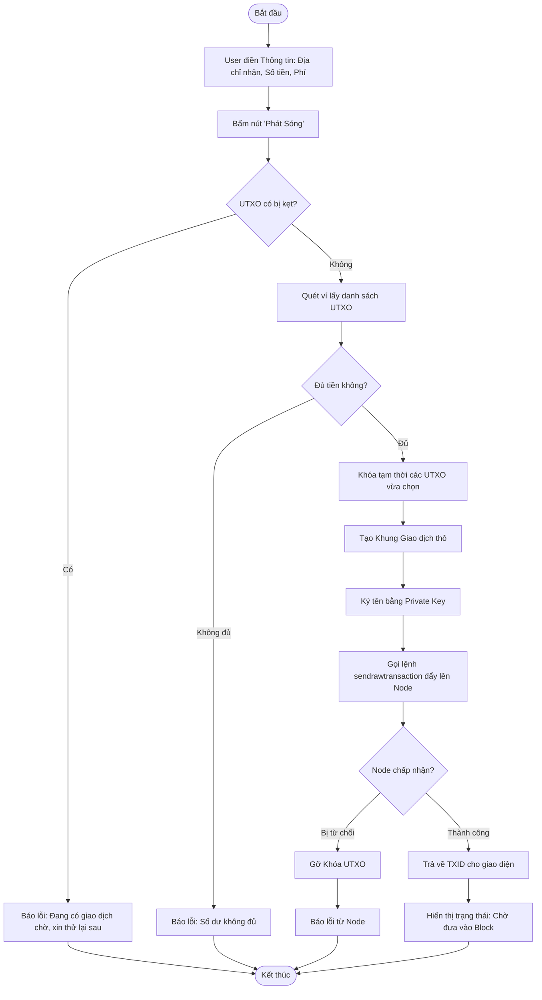
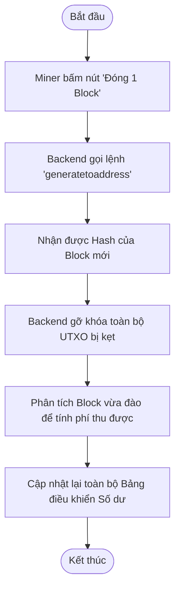

# Sơ đồ Hoạt động (Activity Diagrams)

Tài liệu này sử dụng Mermaid flowchart để mô phỏng chính xác đường đi nước bước (Luồng xử lý) của hệ thống khi người dùng thao tác trên Web App.

## 1. Luồng Hoạt động: Chuyển tiền (Send Transaction)

Đây là luồng hoạt động khi Người dùng (User) bấm nút Gửi tiền trên Web.

## 2. Luồng Hoạt động: Đóng Block (Mine Block)

Đây là luồng hoạt động khi Thợ Đào (Miner) bấm nút Đóng Block trên bảng điều khiển.

