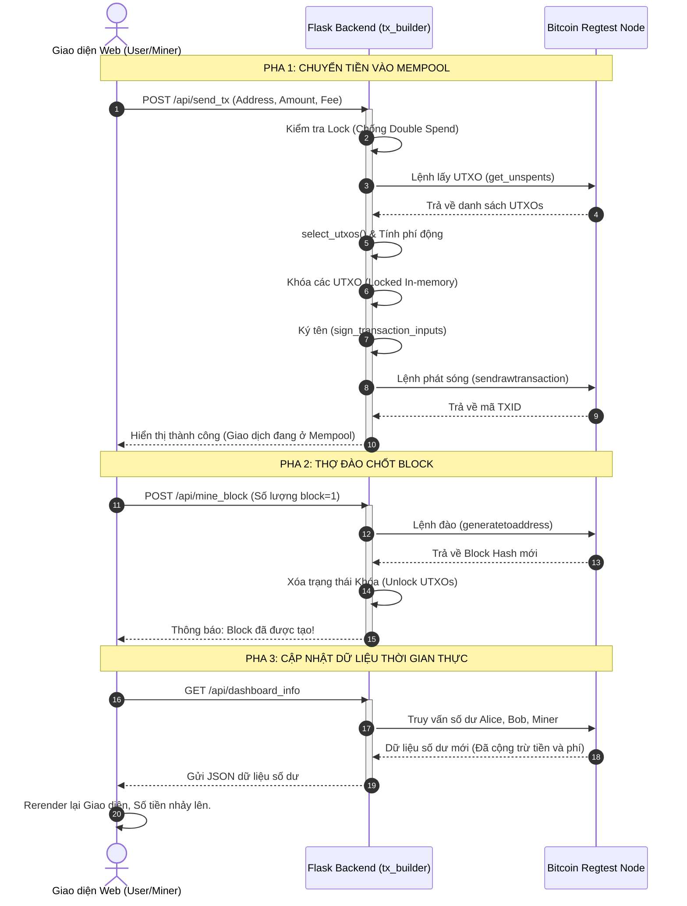

# Sơ đồ Tuần tự (Sequence Diagram)

Sơ đồ này mô tả chi tiết cách 3 thành phần hệ thống giao tiếp với nhau theo thời gian thực (Time-based):
1. **Frontend (Giao diện Web HTML/JS)**: Nơi User và Miner tương tác.
2. **Backend (Flask API)**: Bộ não điều khiển, nơi chứa File `tx_builder.py`.
3. **Bitcoin Node (Regtest)**: Máy chủ cốt lõi xử lý chuỗi khối.

---

## 1. Kịch bản Gửi tiền và Đóng Block hoàn chỉnh

